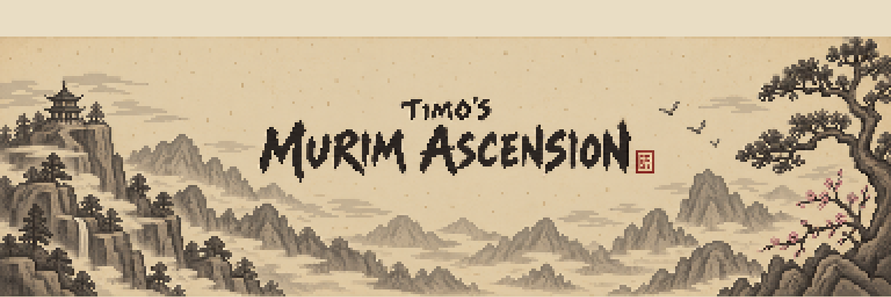
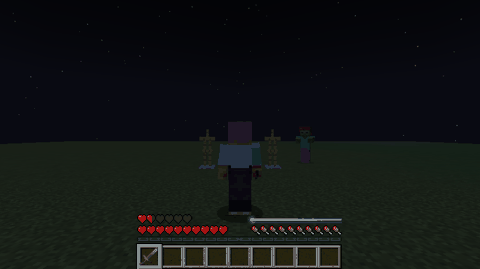
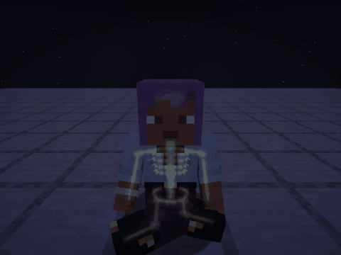
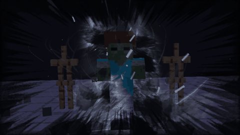
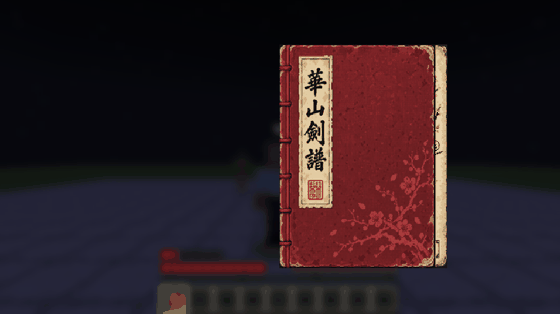
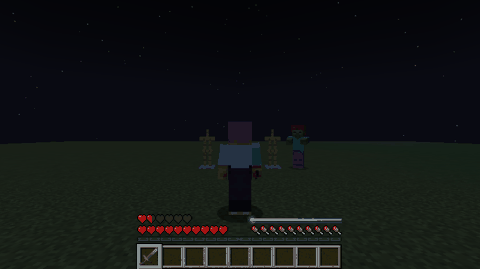
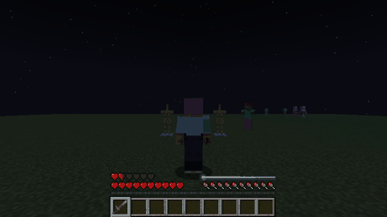
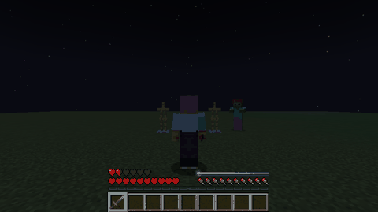

<div align="center">



# Timo's Murim Ascension

**Murim martial-arts cultivation for Minecraft** — gather qi, read sword manuals, master
techniques layer by layer and climb from Third Rate toward the realms beyond.




</div>

## ✦ What it is

A murim (Korean/Chinese martial-arts fantasy) mod built around **techniques that look and
feel like the manhwa**: every form is a particle simulation — petals, wind, smoke, impact
frames — not a flat texture, and every technique grows with your mastery.

## ✦ Features

### Cultivation
- Form a **dantian**, gather qi into a reserve and circulate it; **meditate** to refine it.
- **Cultivation methods** with their own nature of energy.
- **Breakthroughs** between ranks, each with its own scene; stronger masters press you with
  their **aura**.

| Breakthrough | Aura pressure |
|:---:|:---:|
|  |  |

### Techniques and mastery
- Every technique has **layers**: you master it in fights, training and meditation.
  Layer 0 is a clumsy motion; effects grow with each layer.
- **Style manuals** (pixel-art books): the style's title, the style itself, then every form —
  learned in order, each harder than the last.

<p align="center"></p>

### Mount Hua sword
**Seven Plum Blossoms Sword** — seven forms: Cut · Palisade, Whirlwind, Execution, Rush,
Plum Blossom Shower, Plum Blossom Explosion.

| Cut · Palisade | Whirlwind |
|:---:|:---:|
|  |  |
| **Plum Blossom Shower** | **Plum Blossom Explosion** |
|  |  |

**Twenty-Four Plum Blossom Movements** — the secret art: Rainfall, Dome, Scatter, River.

| Dome | Scatter |
|:---:|:---:|
|  |  |

Also: **Falling Petal Sword**, **Six Harmonies Sword**, **Demon Destruction Palm**.

### Tang clan hidden weapons
Real flying daggers that track, curve and hit by contact: **Five Successive Lightning Strikes**,
**Soul-Stealing Seven Stars**, **Dark Eruption Dagger** — with recall, a second dagger that doubles the first,
and counterplay for the enemy.

### Pills and places of power
Eat a pill and sit down to meditate in time — guide the flow of its qi through your meridians with the mouse
(calm or wild, short path or detour); succeed and it works ten times stronger, combine up to three rare pills.
Spirit-vein stones, old trees, peaks and running water speed up meditation — at a risk.

### Footwork
Footwork is a style of its own forms: evade, run, shadow, strike-through
(Dark Fragrance, Wind God Steps). Double-tap to evade, sprint to run, crouch still to fade.

### Combat
- **Lock-on**: the camera follows the target; rushes and thrusts reach enemies in the air.
- **Technique wheel**, per-technique cooldowns, stuns that really stop the enemy.
- Sword arts need a sword — without one you fight with a **qi-sword**.
- **Bandits** (swordsman, archer) with readable wind-ups; some know a weak qi technique.

## ✦ Controls

| Key | Action |
|---|---|
| `R` | use the selected technique |
| `V` (hold) | technique wheel |
| `K` | technique scroll (loadout) |
| `Z` | lock on |
| `G` | meditate |
| double-tap `A` / `D` / `S` | footwork evade |

All keys can be rebound. All in-game texts are in **English** and **Russian**.

## ✦ Build

```bash
./gw build        # finds a JDK 21 for you; or ./gradlew build
./gw runClient
```

The jar lands in `build/libs/`.

## ✦ Roadmap

- [x] Cultivation, ranks and breakthroughs
- [x] Mount Hua sword styles, footwork, manuals
- [x] Lock-on combat, bandits
- [ ] Rank power, bandit camp and the first loop (find a manual → learn → fight → break through)
- [ ] A boss
- [x] Pills (absorption mini-game) and places of power
- [ ] Ruins, libraries and a cult built from modular pieces
- [x] Tang clan hidden weapons (first three forms)
- [ ] Mount Hua sect: location, masters, training
- [ ] Other schools

## ✦ License

All rights reserved. Technique and rank names are murim genre vocabulary; no third-party
artwork is included in this repository.

---

<sub>По-русски: мод в жанре мурим для Minecraft 1.21.1 (NeoForge) — культивация ци,
манускрипты техник и освоение по слоям, стили меча Хуашань, шаги, захват цели, бандиты.
Все тексты в игре — на русском и английском.</sub>
